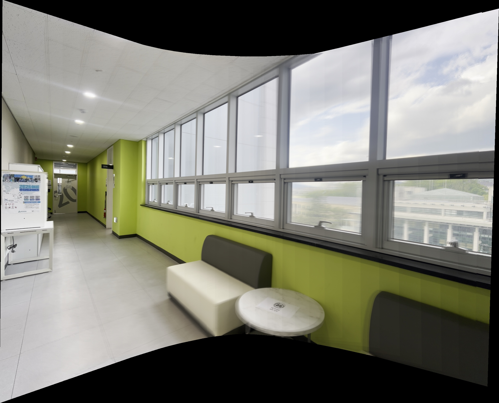

#   Panorama Stitcher

A custom Python pipeline that extracts keyframes from a panning video and stitches them into a seamless panoramic image using Planar Homography and Average Blending. 

## ✨ Key Features & Extra Implementations

1. **Video Keyframe Extraction (Extra Feature)**
   - Instead of manually taking individual photos with insufficient overlap, the program automatically reads a video file and extracts $N$ evenly spaced keyframes. This guarantees extremely high overlap between adjacent frames, minimizing `cv::BRISK` feature extraction failures and RANSAC outliers.

2. **Chained Homography for $N$-Images**
   - The pipeline generalizes the 2-view planar homography to an $N$-view system. It designates the median frame as the global anchor and accumulates transformation matrices (e.g., $H_{0 \rightarrow 2} = H_{1 \rightarrow 2} \times H_{0 \rightarrow 1}$) to warp all frames into a single, unified coordinate system.

3. **Dynamic Canvas Sizing**
   - After computing the chained homographies, the algorithm calculates the extreme coordinates (bounding box) of all transformed corners using `cv.perspectiveTransform`. It then applies a global translation matrix ($T$) to ensure no parts of the panorama are cropped out.

4. **Average Blending for Seamless Seams (Extra Feature)**
   - To eliminate harsh, visible seams caused by simple overlapping, the pipeline employs a weighted average blending technique. It creates an alpha mask for each warped image, calculates the pixel intersection frequencies (Weight Map), and divides the accumulated pixel values by these weights to create a natural transition.

## 🔬 Limitation Analysis & Engineering Discussions

During the development and testing of this pipeline with 20 video keyframes, a significant "bowtie-shaped" perspective distortion was observed at the far edges of the panorama. 

This is a mathematical limitation of the **Planar Projection** model. When mapping a wide Field-of-View (FOV) onto a single 2D plane, the projection distance $d = f \tan(\theta)$ approaches infinity as the angle $\theta$ increases from the optical center. This causes the peripheral pixels to stretch exponentially. 

To fundamentally resolve this, a pre-processing step involving **Cylindrical or Spherical Warping** is required before homography estimation. However, mapping pixels to a cylinder requires accurate estimation of the camera's focal length ($f$) and introduces black-border artifacts that can interfere with descriptor matching. Therefore, this project prioritizes matching stability and smooth blending, acknowledging the planar FOV limit as a trade-off.

## 🚀 Execution Result

### 1. Source Panning Video
| Source Video (Input) |
| :---: |
|  |

*The above video shows the continuous frames from which keyframes were extracted for the stitching process.*

### 2. Result
